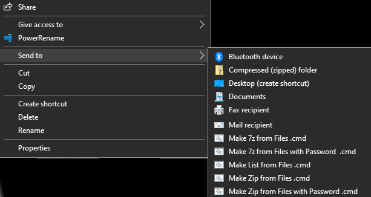

# README

## PSCMB (Powershell Context Menu Booster)

This software extends the Windows context menu. And a tool created with powershell. We are aiming for something as powerful as the right head of Cerberus.

## Requirement

* Powershell 6 or Later
* Windows 10 or Later

## Installation

Download archive from release page, And unzip.
Then, please run `Install-To-ContextMenu.ps1`.

## Contribute

First action is `git clone`.
Run `cd BurntToast`.
Run as described below.
```
git init BurntToast
git config core.sparsecheckout true
git remote add origin https://github.com/Windos/BurntToast.git
echo BurntToast > .git/info/sparse-checkout
git pull origin main 
```

## Usage

Select multiple files and select "Send" from the right-click menu.

### Demo



## Author

@ShortArrow

## License

Under [MIT license](https://en.wikipedia.org/wiki/MIT_License).

## Release

First action is `git clone`. next, as described below.

```bash
git tag -a v1.0.0 -m 'version 1.0.0'
git push origin v1.0.0
```