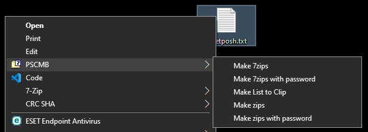

# README

## PSCMB (Powershell Context Menu Booster)

This software extends the Windows context menu. And a tool created with powershell. We are aiming for something as powerful as the right head of Cerberus.

## Requirement

* Powershell 6 or Later
* Windows 10 or Later

## Installation

Download archive from release page, And unzip.
Then, please run `./bin/install.cmd`.

## Uninstallation

Download archive from release page, And unzip.
Then, please run `./bin/uninstall.cmd`.

## Contribute

First action is `git clone`.

Run `cd BurntToast`.
And run as described below, to get BurntToast.

```bash
git init BurntToast
git config core.sparsecheckout true
git remote add origin https://github.com/Windos/BurntToast.git
echo BurntToast > .git/info/sparse-checkout
git pull origin main 
```

Next, get process instance manager, like this.

```powershell
mkdir SingleInstance
$url = https://github.com/zenden2k/context-menu-launcher/releases/latest/download/singleinstance.exe
$file = ./SingleInstance/singleinstance.exe
Invoke-WebRequest -Uri $url -OutFile $file
```

Or this.

```bash
mkdir SingleInstance
if curl -s -L "https://github.com/zenden2k/context-menu-launcher/releases/latest/download/singleinstance.exe" -o "./SingleInstance/singleinstance.exe"; then
    echo downloaded
fi
```

## Usage

Select multiple files and select Menu from the right-click menu, like demo after bellow.

### Demo




## Author

@ShortArrow

## License

Under [MIT license](https://en.wikipedia.org/wiki/MIT_License).

## Release

First action is `git clone`. next, as described below.

```bash
git tag -a v1.0.0 -m 'version 1.0.0'
git push origin v1.0.0
```